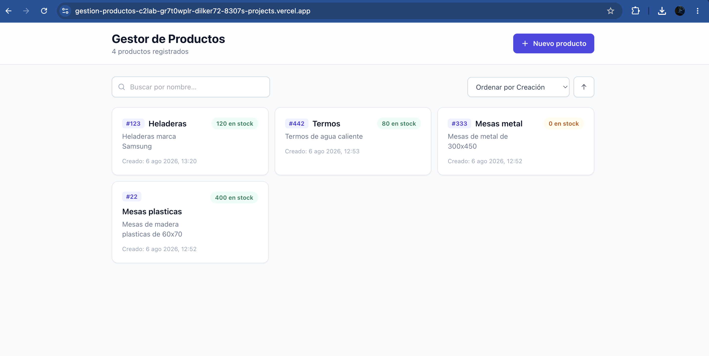
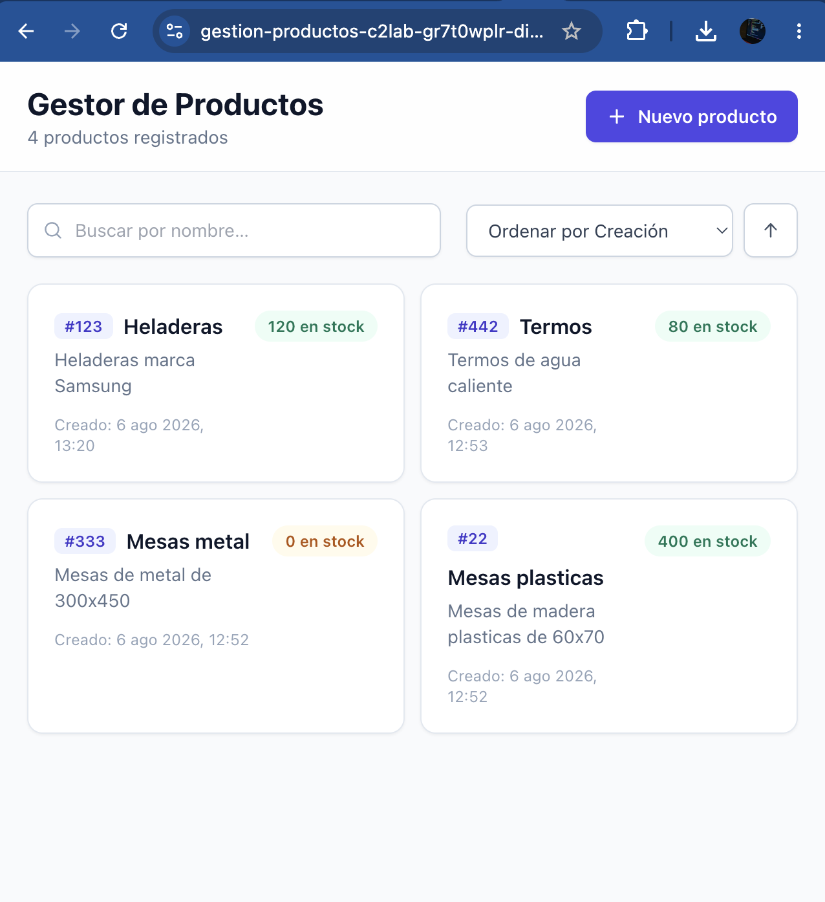
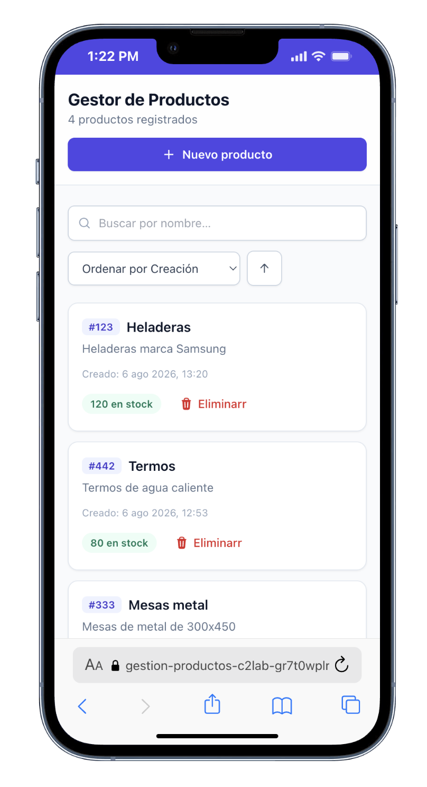
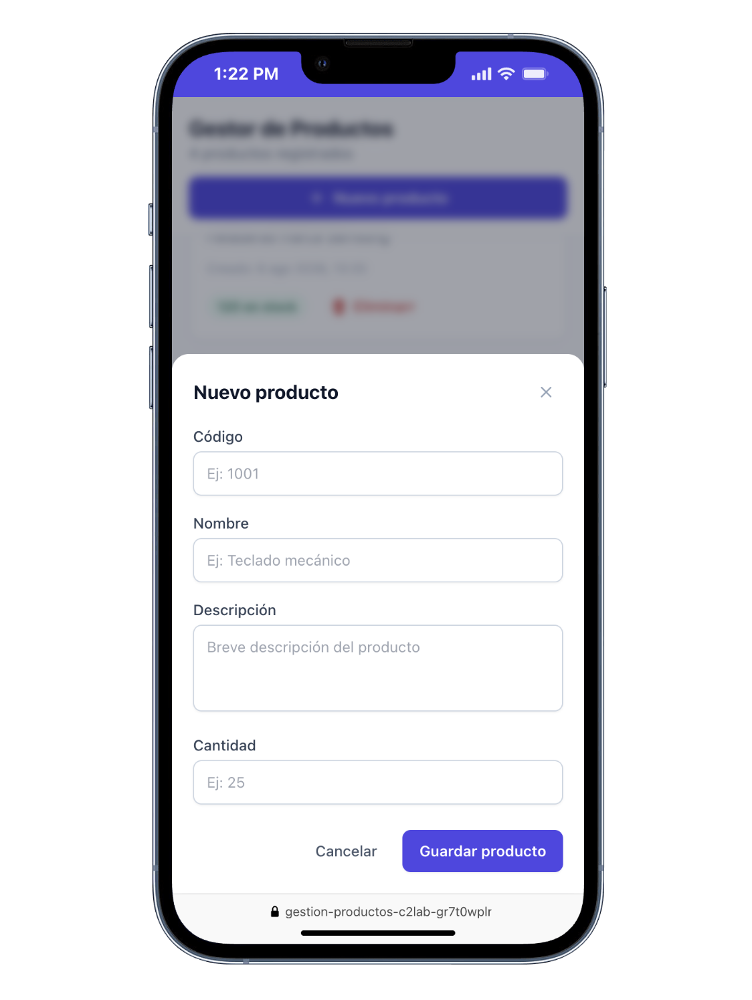
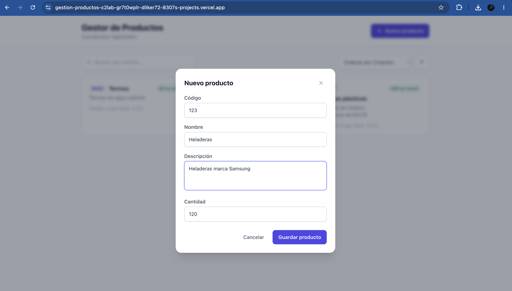
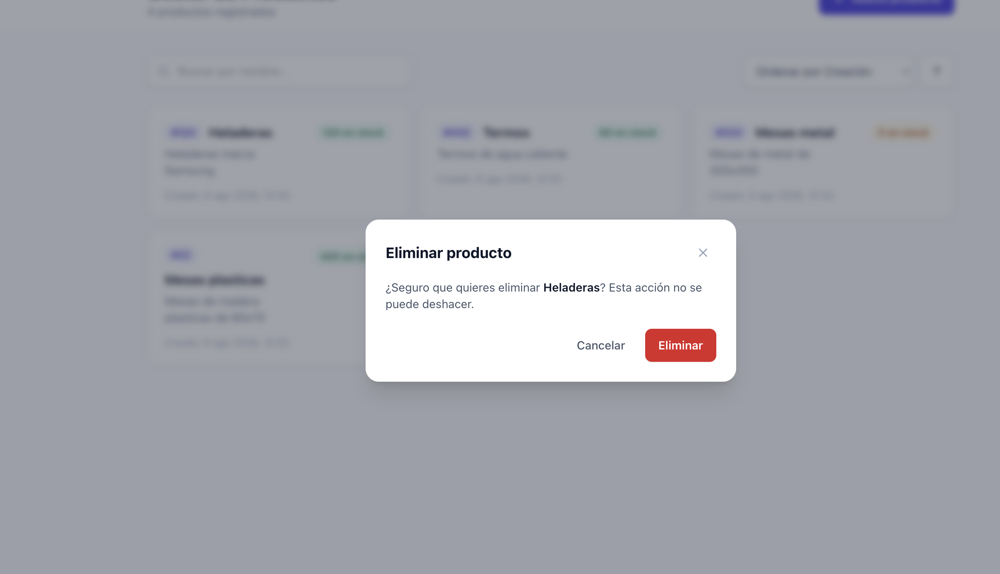
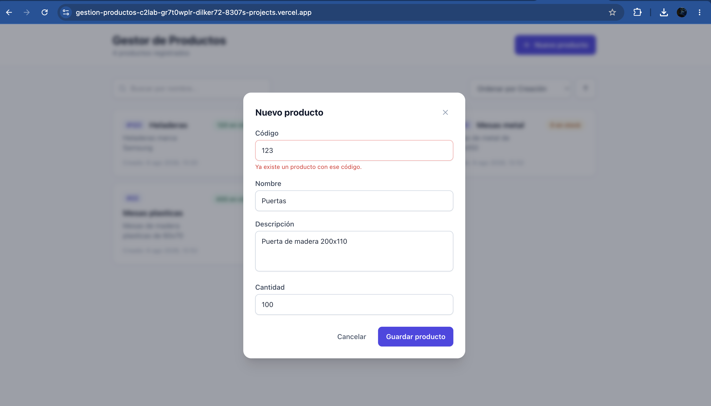

# Gestor de Productos

Aplicación web para la gestión de productos desarrollada con **React + TypeScript + Vite**.

Permite crear, visualizar, buscar, ordenar y eliminar productos, manteniendo la información guardada en el navegador mediante `localStorage`.

## Demo

Aplicación desplegada en Vercel:

https://gestion-productos-c2lab-gr7t0wplr-dilker72-8307s-projects.vercel.app

## Capturas

### Vista principal



---



### Vista responsive móvil



---


### Formulario de creación de producto


 ---


 ---

 ---
## Características principales

* Crear nuevos productos.
* Listar productos registrados.
* Eliminar productos.
* Buscar productos por nombre.
* Ordenar productos por:

  * cantidad
  * fecha de creación
  * código
  * nombre
* Orden ascendente y descendente.
* Persistencia de datos usando `localStorage`.
* Validación de formularios.
* Validación para evitar registrar productos con un código existente.
* Diseño adaptable para dispositivos móviles y escritorio.

---

## Tecnologías utilizadas

* React
* TypeScript
* Vite
* Context API para manejo del estado global
* Tailwind CSS
* ESLint
* UUID para generación de identificadores únicos

---

## Instalación y ejecución local

Requisitos:

* Node.js 18 o superior
* npm

Clonar el repositorio:

```bash
git clone https://github.com/Dilker15/Gestion-Productos-c2lab.git
```

Instalar dependencias:

```bash
npm install
```

Ejecutar el proyecto:

```bash
npm run dev
```

La aplicación estará disponible en:

```
http://localhost:5173
```

---

## Scripts disponibles

Ejecutar en desarrollo:

```bash
npm run dev
```

Crear versión de producción:

```bash
npm run build
```

Ejecutar validación de código con ESLint:

```bash
npm run lint
```

---

##  Estructura del proyecto

```
src/
│
├── components/     # Componentes reutilizables de la interfaz
├── context/        # Context API y Provider global
├── hooks/          # Hooks personalizados
├── types/          # Tipos e interfaces TypeScript
├── utils/          # Funciones auxiliares
│
└── main.tsx
```

---

## Decisiones del proyecto

* Se utilizó **Context API** para manejar el estado global de los productos, evitando agregar librerías externas y manteniendo una solución simple para el tamaño actual de la aplicación.

* Se implementó persistencia con `localStorage`, permitiendo conservar los productos registrados aunque el usuario cierre el navegador.

* Se separó la aplicación en componentes reutilizables para mantener el código organizado y fácil de mantener.

* Se agregó validación en el formulario para controlar datos incorrectos y evitar productos duplicados mediante el código del producto.

* Se utilizó `uuid` para generar identificadores únicos internos para cada producto.

* Se agregó un hook personalizado `useDebounce` para mejorar la búsqueda evitando ejecutar filtros innecesarios mientras el usuario escribe.

* Se configuró ESLint para detectar problemas comunes y mantener una mejor calidad del código.

---

## Diseño

* Interfaz responsive adaptada para móvil y escritorio.
* Formularios con mensajes de validación.
* Indicador visual para productos con stock bajo (cantidad menor o igual a 5).

---

## Autor

Dilker Cartagena
